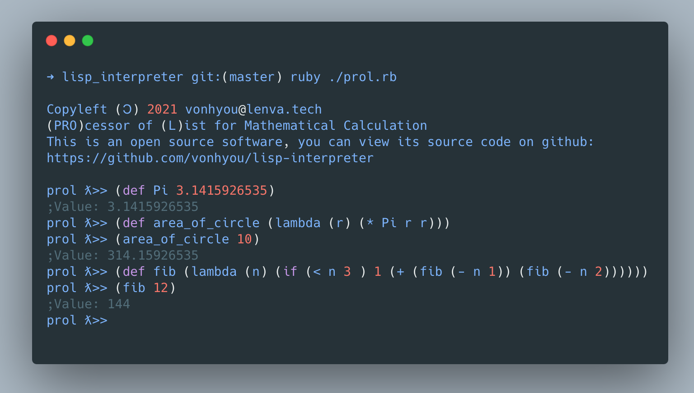

## Yet another lisp interpreter

**PRO**cessor of **L**ist for Mathematical Calculation

It's a simple minimal lisp interpreter written by ruby.



### Feature

- Basic functions as a minimal lisp
- **No** support for `String`

### Usage

```bash
$ ruby ./prol.rb
```